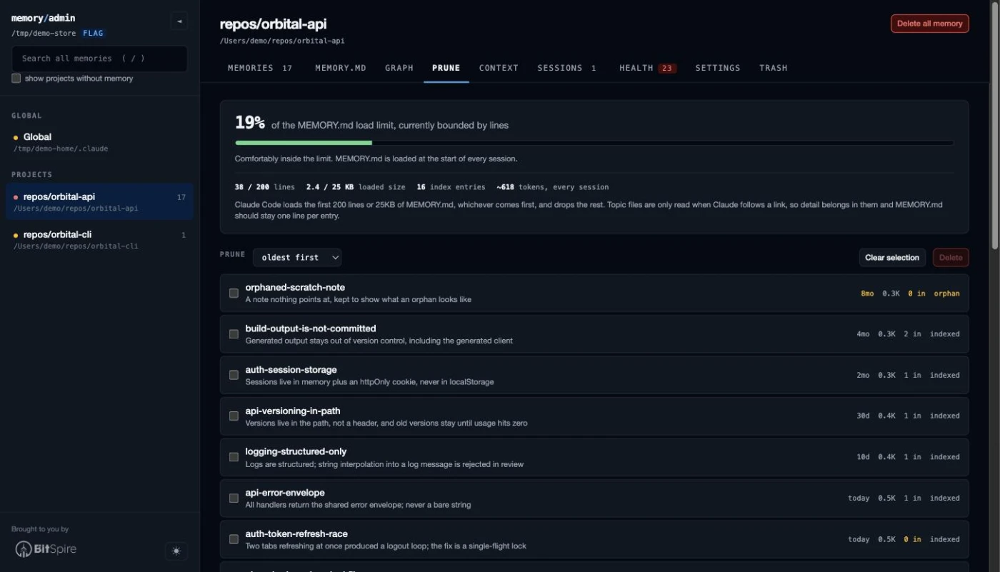

# claude-memory-admin

[](https://github.com/linkdotnet/claude-memory-admin/actions/workflows/ci.yml)
[](https://www.npmjs.com/package/claude-memory-admin)

Browse, audit and prune the memory Claude Code writes for itself: the **auto
memory** kept per project, and the **subagent memory** kept per agent.

```bash
npm install -g claude-memory-admin
claude-memory-admin
```

It opens `http://localhost:4173` and reads `~/.claude/projects/*/memory/`.
Nothing leaves your machine; the server binds `127.0.0.1` only.

<sub>Brought to you by [BitSpire](https://bitspire.ch/).</sub>

---

### Prune: see what MEMORY.md actually costs you



### Graph: see how memories link to each other


---

## What this is for

Claude Code keeps two kinds of memory. This tool is about the second one:

| | CLAUDE.md | Auto memory |
| --- | --- | --- |
| Written by | you | Claude |
| Lives in | `./CLAUDE.md`, `~/.claude/CLAUDE.md` | `~/.claude/projects/<project>/memory/` |
| Contains | rules and instructions | learnings Claude picked up |

Subagents declaring `memory:` in their frontmatter get their own directories,
which hold exactly the same thing under a different name, so they are shown
alongside the projects:

| Scope | Lives in |
| --- | --- |
| `user` | `~/.claude/agent-memory/<agent>/` |
| `project` | `<repo>/.claude/agent-memory/<agent>/` |
| `local` | `<repo>/.claude/agent-memory-local/<agent>/` |

The project-scoped ones are found under the repositories this tool already
resolved from your session transcripts, so it never goes looking through
directories it has no reason to believe in. A `project`-scoped store is checked
into git, and the app says so before you delete anything from one.

The auto memory directory holds `MEMORY.md` (a concise index) plus one topic
file per memory, cross-linked with `[[wikilinks]]`.

**`MEMORY.md` is loaded at the start of every session, and only the first 200
lines or 25KB, whichever comes first.** Everything past that cutoff is silently
dropped. That single fact drives most of this tool: it shows you how close each
project is to the cliff, and makes it quick to get back under it.

## What it does

- **Projects by real path.** The directories on disk are slugified cwds
  (`-Users-me-repos-Blog`) and the slugification is lossy. The true path is
  recovered from the `cwd` field in the session transcripts stored next to each
  memory directory; anything that cannot be confirmed is shown as the raw slug
  rather than a plausible guess. Claude Code keys the store on the git
  repository, so one memory directory serves every worktree and subdirectory of
  a repo: when the transcripts disagree, the repository root wins and the other
  directories are listed under the project name.
- **A store keeps its name after its evidence expires.** Claude Code sweeps
  session transcripts on a retention period but never touches `memory/`, so a
  project eventually loses the only proof of what it was called. **Remember
  path** records one you confirm, and is the single thing this app writes
  outside a `memory/` directory.
- **Where the store is** is read the way Claude Code reads it: `autoMemoryDirectory`
  from any settings layer, managed policy through project and local, not just
  `~/.claude/settings.json`. A value that is neither absolute nor `~/`-prefixed
  is reported rather than quietly ignored.
- **Whether Claude is still writing.** A project with `autoMemoryEnabled` off, or
  `CLAUDE_CODE_DISABLE_AUTO_MEMORY` set, has a store that will never grow again,
  which on disk is indistinguishable from one Claude has not learned anything
  about yet. The project header says which it is, and names the file that decided.
- **Search across every project**: names, descriptions, bodies and index hooks,
  with snippets and match highlighting. Press `/` to jump to it.
- **Read each memory** with its frontmatter as structured metadata and
  `[[wikilinks]]` as clickable links. Dead links are struck through in red.
- **Prune** (see below).
- **Graph** the wikilinks between memories. Hovering dims everything that is not
  a neighbour, which is the only practical way to read a dense cluster.
- **Health**: orphans, dangling pointers, broken wikilinks, files linked only
  mid-sentence, `name` fields that disagree with the filename.
- **Dates you can trust.** Claude Code stamps `modified` into frontmatter, but
  only on files that already have some, and never adds frontmatter to a file
  without it. Anything falling back to the file's mtime is labelled, because
  mtime is reset by any copy or restore.
- **Context**: what a session starting in this project would load as
  *instructions*, which is the other half of the startup budget (see below).
- **Delete with cascade**, always reversible.

Everything above works the same on both kinds of store. The load meter, graph,
health checks and trash never needed to know which they were reading: a subagent
memory directory is a `MEMORY.md` index plus topic files under the same 200-line
/ 25KB limit.

## Keeping MEMORY.md small

The **Prune** tab exists because a bloated index costs tokens on every single
session and, past the limit, silently stops loading.

- **Load meter**. How much of the 200-line / 25KB budget the index uses, and
  which of the two is binding. Frontmatter and HTML comments are excluded,
  because Claude Code strips those before loading.
- **The cutoff, drawn where it falls**. Past the limit, the MEMORY.md tab rules a
  line across the file and dims everything below it, and Prune names the memories
  that stopped being loaded. Because the stripping shifts every line, the cutoff
  is mapped back to real line numbers rather than counted in the loaded text.
- **Long hooks**. The hook is the text after the dash in `MEMORY.md`. A
  400-character hook can cost more than the memory it points at, and shortening
  it is the cheapest win available.
- **Possible overlap**. Pairs of memories ranked by shared *rare* vocabulary, to
  surface the same lesson saved three times from three sessions. It is a hint,
  not a verdict.
- **Bulk prune**. Sort by age, size, or inbound links, tick several, delete them
  as one restore point.

Anthropic's own guidance for the index: one line per entry, detail in the topic
files, merge or drop stale entries.

## The other half of the budget

`MEMORY.md` is not the only thing loaded at the start of every session. The
**Context** tab resolves what else is, in load order: managed policy, your
`~/.claude/CLAUDE.md` and `~/.claude/rules/`, every `CLAUDE.md` and
`CLAUDE.local.md` from the filesystem root down to the project, `.claude/CLAUDE.md`,
and `.claude/rules/`, with `@path` imports expanded and `claudeMdExcludes` applied.

Unlike `MEMORY.md`, none of it is truncated: `CLAUDE.md` files load in full
however long they are. So the tab reports cost rather than a cliff, and separates
what every session pays for from the path-scoped rules that only load on a match.

It also finds the failures that leave a file silently doing nothing:

- Imports that do not resolve, chains past the four-hop maximum, and cycles.
- Imports resolving outside the project, which Claude Code asks you to approve
  once and which stay disabled if you decline.
- A `paths:` glob with a `[` that cannot be read as a bracket expression. It is
  invalid, so it matches nothing and the rule never applies.
- Brace expansion past the 1,000-pattern budget, where the pattern is used
  unexpanded and its literal braces match no file either.
- An `AGENTS.md` that no `CLAUDE.md` imports. Claude Code reads `CLAUDE.md`.

Backticks are respected, so a `` `@README` `` in your prose is not reported as an
import, and neither is an email address.

This is re-derived from the documented resolution rules rather than reported by
Claude Code, and the tab says so. Run `/context` in a session for the ground
truth, or the `InstructionsLoaded` hook to log exactly what loaded and why.

## Deleting is reversible

Delete shows a preview first: the exact lines that will go, the prose mentions it
will deliberately leave alone, and which other memories link here and will break.
Those linking memories each get a checkbox, tick any you want removed in the same
operation, and they are trashed and restored as a single step.

**Delete all memory** clears one project: `MEMORY.md` and every memory file, as
one restore point. Session transcripts (`*.jsonl`) and the project folder are
never touched, only the contents of `memory/`.

**Remove link** in the Health tab clears a `[[wikilink]]` whose target no longer
exists. The markup goes and the words stay, so `see [[gone]] for details` becomes
`see gone for details`.

Everything lands in `memory/.trash/` with a restore record and comes back from the
Trash tab. The app never creates memories and never rewrites their prose beyond
clearing a dead link's brackets.

## Usage

```
claude-memory-admin [options]

  -p, --port <n>    port to listen on       (default 4173)
  -r, --root <dir>  memory store to read    (default ~/.claude/projects)
      --no-open     do not launch a browser
  -h, --help        show help
  -v, --version     print the version
```

Point it at a copy if you want to experiment safely:

```bash
cp -R ~/.claude/projects /tmp/memory-snapshot
claude-memory-admin --root /tmp/memory-snapshot
```

## Safety

- Binds `127.0.0.1`; no telemetry, no network calls.
- Every write target must resolve to a plain `.md` file inside that project's own
  `memory/` directory. `..`, absolute paths and subdirectories are refused.
- One exception, and only when you ask for it: **Remember path** writes
  `~/.claude-memory-admin/paths.json`. It holds folder slugs and the directory
  paths you confirmed, never memory content, and forgetting the last entry
  deletes the file. Nothing creates it until you use the action.
- `MEMORY.md` is replaced atomically (temp file, `fsync`, `rename`) with a backup
  restored if anything throws.
- A test asserts that parsing and rewriting every real `MEMORY.md` with no
  deletions reproduces it byte for byte. Real indexes are hand-written prose with
  headings and nested bullets, and mangling one would be silent.

## Development

```bash
git clone https://github.com/linkdotnet/claude-memory-admin
cd claude-memory-admin
npm install
npm start                 # or: node server.mjs
npm test                  # runs on a throwaway copy of your real store
```

No bundler and no build step: the backend is `node:http` plus `node:fs`, and the
frontend is plain ES modules the browser loads directly. Two runtime dependencies,
`marked` and `dompurify`, both only for rendering memory bodies safely.

| Path | Purpose |
| --- | --- |
| `bin/claude-memory-admin.mjs` | CLI entry point and argument parsing |
| `server.mjs` | HTTP server: static files + JSON API |
| `src/projects.mjs` | Project discovery, slug → real path resolution |
| `src/settings.mjs` | Layered reads of Claude Code's settings files |
| `src/pathcache.mjs` | The opt-in record of confirmed project paths |
| `src/stores.mjs` | Store discovery: auto memory and the three agent scopes |
| `src/instructions.mjs` | CLAUDE.md chain, `@` imports and rules resolution |
| `src/parse.mjs` | `MEMORY.md` and frontmatter parsers, wikilinks |
| `src/model.mjs` | Joins index, files, graph and health into one model |
| `src/stats.mjs` | Load-limit accounting and overlap detection |
| `src/search.mjs` | Full-text search across every store |
| `src/mutate.mjs` | Delete / restore / unlink, the only code that writes |
| `public/` | Frontend |

Tests run against committed fixtures under `test/fixtures/`: a projects store
encoding the awkward shapes real memory directories contain, including one index
deliberately past the load limit, an `agents/` tree covering all three subagent
scopes, and an `instructions/` tree covering the import and glob edge cases. Your own
`~/.claude/projects` is additionally checked when it exists, always on a
throwaway copy.

### Releasing

Publishing runs in CI. You do not bump anything by hand.

Go to **Actions, Release, Run workflow**, pick `patch`, `minor` or `major`, and
run it. The workflow tests, bumps `package.json` and `package-lock.json`, commits
and tags the bump, pushes both, then publishes to npm.

If you would rather cut the version locally, that still works:

```bash
npm version patch
git push --follow-tags
```

Pushing a `v*` tag publishes whatever is in `package.json`, after checking the
two agree. Either route refuses to publish a version that is already on npm,
because npm never allows one to be replaced.

It needs one repository secret:

| Secret | Value |
| --- | --- |
| `NPM_TOKEN` | an npm **Automation** access token with publish rights |

Add it under *Settings, Secrets and variables, Actions, New repository secret*.
An Automation token is the right kind because it bypasses 2FA, which an
unattended workflow cannot satisfy.

Releases are published with [npm provenance](https://docs.npmjs.com/generating-provenance-statements),
so every version carries a signed, verifiable record of the workflow run and
commit that built it. That needs the `id-token: write` permission the workflow
already requests, a public repository, and the `repository` field in
`package.json` pointing at this repo.

Two things that will bite if they apply to you: the workflow pushes the bump
commit to the default branch, so a branch protection rule that blocks pushes
will stop it; and the tag it pushes uses `GITHUB_TOKEN`, which by design does
not trigger other workflows, so there is no double publish.

### Screenshots and demo data

The screenshots come from an invented store, never a real one:

```bash
node scripts/demo-store.mjs /tmp/demo-store
npm start -- --root /tmp/demo-store
```

## License

MIT
