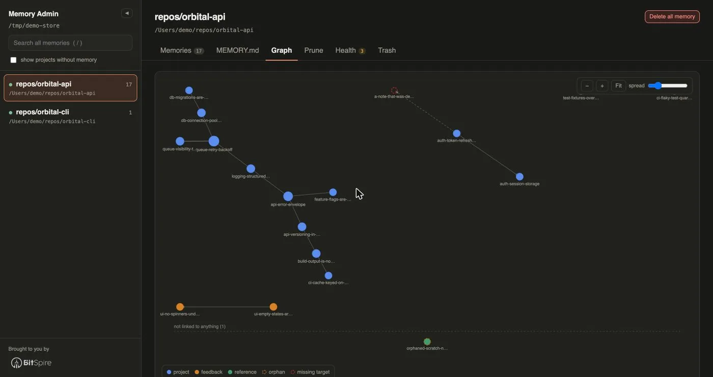

# claude-memory-admin

[](https://github.com/linkdotnet/claude-memory-admin/actions/workflows/ci.yml)
[](https://www.npmjs.com/package/claude-memory-admin)

Browse, audit and prune the memory Claude Code writes for itself: the **auto
memory** kept per project, and the **subagent memory** kept per agent.

```bash
npm install -g claude-memory-admin
claude-memory-admin
```

It opens `http://localhost:4173` and reads `~/.claude/projects/*/memory/`.
Nothing leaves your machine; the server binds `127.0.0.1` only.

This project is built heavily with AI tooling: most of the code, the tests
and this README were written by Claude Code, with a human directing the design
and reviewing what landed. Fitting for a tool about what Claude writes for
itself, and worth saying out loud.

---

### Cleanup: what MEMORY.md costs you and what is broken, in one list


### Memory: the list, the index and the graph


### Graph: see how memories link to each other



### Environment: what every session loads before a project is even chosen


There is a light theme and a dark one, toggled with `t`; the Memory shot above is
the light one and the rest are dark.

---

## What this is for

Claude Code keeps two kinds of memory. This tool is about the second one:

| | CLAUDE.md | Auto memory |
| --- | --- | --- |
| Written by | you | Claude |
| Lives in | `./CLAUDE.md`, `~/.claude/CLAUDE.md` | `~/.claude/projects/<project>/memory/` |
| Contains | rules and instructions | learnings Claude picked up |

Subagents declaring `memory:` in their frontmatter get their own directories,
which hold exactly the same thing under a different name, so they are shown
alongside the projects:

| Scope | Lives in |
| --- | --- |
| `user` | `~/.claude/agent-memory/<agent>/` |
| `project` | `<repo>/.claude/agent-memory/<agent>/` |
| `local` | `<repo>/.claude/agent-memory-local/<agent>/` |

The project-scoped ones are found under the repositories this tool already
resolved from your session transcripts, so it never goes looking through
directories it has no reason to believe in. A `project`-scoped store is checked
into git, and the app says so before you delete anything from one.

The auto memory directory holds `MEMORY.md` (a concise index) plus one topic
file per memory, cross-linked with `[[wikilinks]]`.

**`MEMORY.md` is loaded at the start of every session, and only the first 200
lines or 25KB, whichever comes first.** Everything past that cutoff is silently
dropped. That single fact drives most of this tool: it shows you how close each
project is to the cliff, and makes it quick to get back under it.

## What it does

Everything lives under three tabs, each answering one question:

| Tab | The question | Holds |
| --- | --- | --- |
| **Memory** | what is in here? | the memory list, `MEMORY.md`, the graph |
| **Cleanup** | what should I fix? | the load meter and one worst-first list of fixable things |
| **Environment** | what else does Claude load? | instructions, settings, sessions, tools - and, on Global, the two cost knobs it will write |

Undo is a button in the project header rather than a fourth tab, because it is a
safety net and not a place you browse.

- **Projects by real path.** The directories on disk are slugified cwds
  (`-Users-me-repos-Blog`) and the slugification is lossy. The true path is
  recovered from the `cwd` field in the session transcripts stored next to each
  memory directory; anything that cannot be confirmed is shown as the raw slug
  rather than a plausible guess. Claude Code keys the store on the git
  repository, so one memory directory serves every worktree and subdirectory of
  a repo: when the transcripts disagree, the repository root wins and the other
  directories are listed under the project name.
- **A store keeps its name after its evidence expires.** Claude Code sweeps
  session transcripts on a retention period but never touches `memory/`, so a
  project eventually loses the only proof of what it was called. **Remember
  path** records one you confirm, and is the single thing this app writes
  outside a `memory/` directory. It is now offered *before* that happens: the
  project header counts down the days until the last transcript naming the
  project is swept, rather than waiting until the name is already gone.
- **Where the store is** is read the way Claude Code reads it: `autoMemoryDirectory`
  from any settings layer, managed policy through project and local, not just
  `~/.claude/settings.json`. A value that is neither absolute nor `~/`-prefixed
  is reported rather than quietly ignored.
- **Whether Claude is still writing.** A project with `autoMemoryEnabled` off, or
  `CLAUDE_CODE_DISABLE_AUTO_MEMORY` set - in the environment or in the `env`
  block of any settings layer - has a store that will never grow again, which on
  disk is indistinguishable from one Claude has not learned anything about yet.
  The project header says which it is, and names the file that decided.
- **Which subagent still asks for its memory.** A subagent store exists because
  some agent file carried a `memory: user | project | local` field, and it stays
  exactly where it is after that field moves to another scope or is removed. Each
  store is shown next to the definition that declares it - from `agents/` in the
  user scope and in each repository - and one that nothing declares any more is
  marked `orphan`, one whose agent moved scope `moved`. Because subagent memory
  is part of auto memory, turning auto memory off marks every one of them
  `inert`: the `memory:` field stops having any effect, and the agent starts with
  no memory instructions and no file tools at all.
- **A config directory that is not `~/.claude`.** `CLAUDE_CONFIG_DIR` moves the
  projects root, the agent definitions, the agent memory, the user `CLAUDE.md` and
  rules, and the settings file together, and all of them are read from wherever it
  points. The Environment tab names the directory and says whether the environment
  or the default chose it. A `~/` written by hand is expanded here rather than left
  to the shell, because `cmd` and PowerShell do not expand it.
- **Search across every project**: names, descriptions, bodies and index hooks,
  with snippets and match highlighting. Press `/` to jump to it.
- **Read each memory** with its frontmatter as structured metadata and
  `[[wikilinks]]` as clickable links. Dead links are struck through in red.
- **Cleanup** (see below).
- **Graph** the wikilinks between memories, under Memory. Hovering dims everything
  that is not a neighbour, which is the only practical way to read a dense cluster.
- **Where each memory came from.** Claude Code stamps `originSessionId` into a
  memory's frontmatter, and the transcript it names sits next to the store until
  the sweep takes it. The memory reads *written in "Release process notes", on
  `main`* while that transcript is there, and says so plainly once it is gone:
  a swept id is struck through in red, like a dead wikilink, because why the
  memory exists can no longer be traced from anything on disk.
- **Sessions** (under Environment): the transcripts beside a store, with the retention window drawn
  the way MEMORY.md's cutoff is - each session a tick, the sweep line where it
  falls. Under it, a tile per day shades how much work that day held, and
  clicking one narrows the list to it; the grid spans the retention window
  rather than a fixed year, because a year of empty tiles would read as *no
  sessions* when it only means *already swept*. Titles are the ones Claude Code
  generated, falling back to the session
  slug and then the opening prompt; a session that names itself nowhere in the
  part read is shown by id rather than given an invented name. Only the head of
  each file is ever read, so a 200MB store of transcripts costs a quarter of a
  second, and nothing here deletes one.
- **What Cleanup checks**: orphans, dangling pointers, broken wikilinks, files linked only
  mid-sentence, `name` fields that disagree with the filename, two files claiming
  one `name`, a file bulleted twice, a blank `description`, a `type` outside the
  four documented ones, a memory that is frontmatter and little else, a hook that
  only restates the description it points at, a heading with nothing under it, and
  entries that spill onto a second line, a memory whose origin transcript has
  been swept, a project whose last proof of its own path is about to be, and
  sessions that produced no memory at all while auto memory was on. An orphan
  can be given the `MEMORY.md` bullet it is missing without leaving the page.
- **Every count is visible before you click.** Each of the three tabs carries a
  badge, coloured amber for something to tidy and red for something actively
  broken, and the sidebar gives each store a dot of its worst severity - memory,
  instructions and settings together. Which project is in trouble is the first
  thing the app tells you, not something you find by opening every tab in turn.
- **Dates you can trust.** Claude Code stamps `modified` into frontmatter, but
  only on files that already have some, and never adds frontmatter to a file
  without it. Anything falling back to the file's mtime is labelled, because
  mtime is reset by any copy or restore.
- **Instructions** (under Environment): what a session starting in this project
  would load as *instructions*, which is the other half of the startup budget
  (see below).
- **Settings** (under Environment): every layer Claude Code would read, side by
  side, with the value that wins and the ones it shadows (see below).
- **Delete with cascade**, always reversible.

Everything above works the same on both kinds of store. The load meter, graph,
health checks and trash never needed to know which they were reading: a subagent
memory directory is a `MEMORY.md` index plus topic files under the same 200-line
/ 25KB limit.

## Keeping MEMORY.md small

The **Cleanup** tab exists because a bloated index costs tokens on every single
session and, past the limit, silently stops loading. It is one list: the load
meter, then everything worth doing something about, worst first, each row
carrying its own fix. A finding and its fix are never on different tabs.

- **Load meter**. How much of the 200-line / 25KB budget the index uses, and
  which of the two is binding. Frontmatter and HTML comments are excluded,
  because Claude Code strips those before loading.
- **The cutoff, drawn where it falls**. Past the limit, the MEMORY.md segment rules
  a line across the file and dims everything below it, and Cleanup lists the
  memories that stopped being loaded at the top of the worklist, each with
  **Move up**. Because the stripping shifts every line, the cutoff
  is mapped back to real line numbers rather than counted in the loaded text. The
  segment reads the index either **rendered** — headings, lists and clickable entries,
  with pointers to files that do not exist struck through — or as **source**, with
  line numbers. Either way the cutoff is drawn in the same place. The choice is
  remembered.
- **Long hooks**. The hook is the text after the dash in `MEMORY.md`. A
  400-character hook can cost more than the memory it points at, and shortening
  it is the cheapest win available. **Edit hook** rewrites one in place, with the
  projected load meter next to the character count, and changes nothing but the
  text after the separator - the indent, title, link and the separator character
  itself are kept byte for byte, so a project that writes ` - ` keeps writing it.
- **Move above the cutoff**. Past the limit, an entry is on disk but invisible.
  **Move up** relocates its bullet, and the indented lines under it, to the end
  of any section that starts above the cutoff. It moves one entry rather than
  making room, so whatever is now last drops below the line instead - the app
  says so before you do it.
- **Possible overlap**. Pairs of memories ranked by shared *rare* vocabulary, to
  surface the same lesson saved three times from three sessions. It is a hint,
  not a verdict, so it sorts last. **Merge** folds one into the other: the body
  moves under a heading you name, every `[[wikilink]]` that pointed at the source
  is repointed rather than broken, a link the survivor had to the source becomes
  plain text instead of a self-link, and the two index bullets collapse to one.

Bulk pruning is not here, because it is browsing rather than fixing: the **Memory**
list sorts by age, size or inbound links, and **Select** turns on the checkboxes so
several can go as one restore point. One list of memories, not two.

Anthropic's own guidance for the index: one line per entry, detail in the topic
files, merge or drop stale entries.

## The other half of the budget

`MEMORY.md` is not the only thing loaded at the start of every session. The
**Environment** tab's **Instructions** segment resolves what else is, in load order: managed policy, your
`~/.claude/CLAUDE.md` and `~/.claude/rules/`, every `CLAUDE.md` and
`CLAUDE.local.md` from the filesystem root down to the project, `.claude/CLAUDE.md`,
and `.claude/rules/`, with `@path` imports expanded and `claudeMdExcludes` applied.

Unlike `MEMORY.md`, none of it is truncated: `CLAUDE.md` files load in full
however long they are. So it reports cost rather than a cliff, and separates
what every session pays for from the path-scoped rules that only load on a match.

It also finds the failures that leave a file silently doing nothing:

- Imports that do not resolve, chains past the four-hop maximum, and cycles.
- Imports resolving outside the project, which Claude Code asks you to approve
  once and which stay disabled if you decline.
- A `paths:` glob with a `[` that cannot be read as a bracket expression. It is
  invalid, so it matches nothing and the rule never applies.
- Brace expansion past the 1,000-pattern budget, where the pattern is used
  unexpanded and its literal braces match no file either.
- An `AGENTS.md` that no `CLAUDE.md` imports. Claude Code reads `CLAUDE.md`.
- A markdown file sitting in `~/.claude` that nothing in the chain reaches. It
  looks load-bearing and loads nothing, which is what happens when the import
  that pulled it in is deleted or its content is inlined.
- One file reached by two chains - your `~/.claude/CLAUDE.md` and the project's
  own both importing it, say. Both copies load, and you pay for the content twice
  every session.
- A `CLAUDE.md` or rule file that is empty apart from its frontmatter. It costs a
  read and contributes no instruction.

Backticks are respected, so a `` `@README` `` in your prose is not reported as an
import, and neither is an email address.

Every file listed opens in place, so you can read what actually loads without
leaving the page. Nothing here is editable: the app never rewrites a `CLAUDE.md`,
a rule file or anything else in the instruction chain.

### The user scope on its own

The half of that chain no project owns — managed policy, `~/.claude/CLAUDE.md`,
`~/.claude/rules/` and their imports — is also a **Global** entry at the top of
the sidebar. It is what every session on the machine pays for before a project is
even chosen, and it resolves without a project directory, so it is there even when
no project's real path could be recovered from a transcript.

It holds instructions rather than memory, so it has no MEMORY.md, graph or trash,
and search does not reach into it. It is the one entry with a **Cost** tab, below.

This is re-derived from the documented resolution rules rather than reported by
Claude Code, and the app says so. Run `/context` in a session for the ground
truth, or the `InstructionsLoaded` hook to log exactly what loaded and why.

## The one check that reads your code

Every check above reads `memory/` and the `CLAUDE.md` chain, and nothing else.
One more is available and **off by default**, because it reads the project itself:
it takes the paths a memory names in a code span and asks whether anything in the
repository still matches them. A memory whose `Foo.cs` was renamed two months ago
still reads as authoritative, and nothing else on this page can tell.

Turn it on from the bottom of the Cleanup tab, per store; the choice is remembered in the browser
and nothing is written to disk. It walks the project once, skipping `.git`,
`node_modules`, build output and the like, and matches by suffix - a memory that
says `Infrastructure/Reporting/Foo.cs` for a file that really lives under
`services/argus/src` is right, and resolving that against the repository root
alone reported seven real paths in ten as missing. Only a token with a real source
extension is treated as a claim about a file, because memories are also full of
HTTP routes and type names that no file was ever going to match.

It is a pointer, not a verdict, and the app says so: a file that moved reads the
same as one the memory never got right.

## Which settings are actually in force

Five files can set the keys this tool cares about, and the one everybody edits,
`~/.claude/settings.json`, is the weakest of them. The **Environment** tab's
**Settings** segment reads all
five and shows, per key, the value that wins and the ones it shadows, struck
through, each labelled with the file it came from:

`autoMemoryEnabled`, `autoMemoryDirectory`, `claudeMdExcludes` and
`cleanupPeriodDays`, plus `CLAUDE_CODE_DISABLE_AUTO_MEMORY` wherever it is set:
in the environment, where it outranks every file, or in the `env` block of any of
the five, which a session exports before it starts and which reading `process.env`
alone would miss. `CLAUDE_CONFIG_DIR` is named here too, since it decides where
all five of those files are looked for in the first place.

It also names the failures that are otherwise silent:

- A settings file that exists but is not valid JSON. Claude Code ignores the
  whole file, so every value in it is doing nothing, and nothing says so.
- A file that parses but is not an object, or cannot be read at all.
- An `autoMemoryDirectory` that is neither absolute nor `~/`-prefixed. A Windows
  path is accepted on any platform, because a settings file is routinely shared
  between machines.
- A `CLAUDE_CONFIG_DIR` that is not absolute, which Claude Code would not accept
  either: the default is used and the fact is reported rather than swallowed.
- A value Claude Code accepts the key of but not the number, like a
  `cleanupPeriodDays` below 1: it shows what is written *and* what applies.

The Settings segment is read-only. It reports what is configured; it never writes
a setting. The Cost segment, below, is the one that does.

## The two settings that decide what a session costs

The **Cost** segment sits on the Global entry, beside Instructions, and it is the
only place in this app that writes anything outside a memory store. Two keys, both
saved to `~/.claude/settings.json`:

- **`CLAUDE_CODE_SUBAGENT_MODEL`** (in the `env` block) - the model every subagent,
  agent-team member and workflow agent runs on. It overrides the model asked for at
  the call site *and* the `model:` line in an agent file, so it is the single switch
  that moves all of them at once. Searching and summarising rarely needs more than
  Haiku, and it is the cheapest change available.
- **`outputStyle`** - `Concise` leads with the result and drops the narration, which
  cuts output tokens on every turn. `Explanatory` and `Learning` add to them by
  design. Custom styles found in `~/.claude/output-styles` are offered alongside the
  built-in ones. It is part of the system prompt, so a change lands on `/clear` or
  the next session, and it reaches the main conversation only - a subagent runs its
  own system prompt.

Each is shown the way the Settings segment shows a key: every layer that sets it,
strongest first, with the losers struck through. Your user file is the weakest of
the five, so when something stronger already sets the key the panel says the save
will not take effect *before* you make it. An environment variable outranks every
file, and is called out when it disagrees with what is on disk.

Below them, one row per agent file in `~/.claude/agents`, each with a **model** and
an **effort** picker - a summariser pinned to Haiku while a reviewer stays on Opus.
Only those two frontmatter fields are ever written: the prompt body, the tool lists
and every other field are left byte-identical, horizontal rules in the prose
included. The built-in Explore, Plan and general-purpose agents are not files and
cannot be retuned here; `CLAUDE_CODE_SUBAGENT_MODEL` is what moves those.

A settings file that exists but does not parse is refused rather than rewritten:
overwriting it would silently drop every setting the tool could not read.

## Tools: what a session saved, next to what it cost

Environment grows a fourth segment, **Tools**, for each companion CLI it finds on
the PATH the server was started with. Nothing appears if none is installed.

Each tool is one collapsible row carrying its own headline - *17.7% saved here*,
*$317 here, 20 sessions* - so the answer is readable without opening anything,
and which row you left open is remembered.

### rtk - what never reached the model

[rtk](https://github.com/rtk-ai/rtk) proxies commands like `grep`, `git` and
`cargo test`, strips their output down before it reaches the model, and keeps a
ledger of what it removed. Its panel shows three things:

- **This project** - what share of everything rtk read here never reached the
  model. rtk scopes its ledger by working directory, so this is exactly the
  commands run from this project's path.
- **Every project** - the same figure for the whole machine, with the last
  thirty days called out separately, because a lifetime average hides a habit
  that changed last week.
- **Left on the table** - commands that ran raw when rtk has a filter for them,
  worst first, with rtk's own estimate of what each would have saved. The
  estimates count what the filter would have stripped, not what the model would
  have ignored.

### ccusage - what it actually cost

[ccusage](https://github.com/ccusage/ccusage) prices the same session transcripts
this app lists under **Sessions**, which makes it the other half of rtk's
arithmetic: rtk reports what it stopped you paying for, ccusage reports the bill
that arrived anyway. Its panel shows:

- **This project** - what it cost, and what share of your whole Claude Code
  spend that is. Sessions are attributed by the project slug ccusage reports,
  which is the same slug this app names each store by.
- **Every project** - the machine-wide total, with the bar showing how much of
  it fell in the last thirty days.
- **Where the money went** - spend per model, so an expensive habit is visible
  as a model choice rather than as a number.
- **Most expensive sessions** - the costliest sessions in this project by id.
  These are the same ids the Sessions segment lists, so clicking one opens that
  transcript there, scrolled to and unfolded. A session Claude Code has already
  swept says so rather than failing quietly.

It runs `ccusage claude session --json --offline`; `--offline` forces the cached
price table, so no network call is made.

### What the segment will and will not do

This is the one place the app runs a program that is not itself, so it stays off
until you press **Read tool stats**, and the answer is remembered. Only
read-only subcommands are called, each tool is looked up by a fixed name in a
small registry rather than by anything a request names, and rtk is only ever
handed a working directory the app resolved on its own.

Savings figures come from the tools themselves and are their own estimates; the
cost figures come from the transcripts and are not.

## Everything it writes is reversible

Delete shows a preview first: the exact lines that will go, the prose mentions it
will deliberately leave alone, and which other memories link here and will break.
Those linking memories each get a checkbox, tick any you want removed in the same
operation, and they are trashed and restored as a single step.

**Delete all memory** clears one project: `MEMORY.md` and every memory file, as
one restore point. Session transcripts (`*.jsonl`) and the project folder are
never touched, only the contents of `memory/`.

**Remove link** in the Cleanup tab clears a `[[wikilink]]` whose target no longer
exists. The markup goes and the words stay, so `see [[gone]] for details` becomes
`see gone for details`.

Everything lands in `memory/.trash/` with a restore record and comes back from the
**Undo** control in the project header, one undo per operation however many files
it touched. Undo is not a place you browse, so it is a button with a count rather
than a tab of its own.

The app never writes a memory file of its own. It edits `MEMORY.md` a line at a
time - a hook rewritten, a bullet added or moved - and each of those keeps every
other byte of the file. Adding a bullet to a project that has no `MEMORY.md` yet
is the one case where a file is created, and undoing it deletes that file again,
but only if nothing has touched it since. **Merge** is the one action that
rewrites prose inside a memory, which is why it shows you every file it will
touch first.

Each index edit keeps a copy of the whole `MEMORY.md` in the trash rather than a
note of which lines changed, so undo means writing back the exact bytes that were
there instead of recomputing them.

## Usage

```
claude-memory-admin [options]

  -p, --port <n>    port to listen on       (default 4173)
  -r, --root <dir>  memory store to read    (default ~/.claude/projects)
      --no-open     do not launch a browser
  -h, --help        show help
  -v, --version     print the version
```

Point it at a copy if you want to experiment safely:

```bash
cp -R ~/.claude/projects /tmp/memory-snapshot
claude-memory-admin --root /tmp/memory-snapshot
```

## Safety

- Binds `127.0.0.1`; no telemetry, no network calls.
- Runs on macOS, Linux and Windows. Line endings are the part of that which is not
  cosmetic: a `MEMORY.md` saved by a Windows editor is CRLF, and a carriage return
  is not something JavaScript's `.` matches, so a file like that once parsed as if
  it were empty - no index entries, no frontmatter, every memory an orphan. It is
  read correctly now, and a rewrite ends its lines the way it found them: a file
  that came back half CRLF and half LF would show every line as changed in git, on
  a change you never made.
- Reads only `~/.claude/projects`, the agent memory directories and the `CLAUDE.md`
  chain, unless you switch on the path check above, which then also walks that one
  project's directory. It only ever reads: no path a memory names is opened, only
  looked up in an index built from the project itself.
- Session transcripts are read at the head only, 16KB and then at most 128KB, and
  never deleted or rewritten. A transcript here reaches 13MB and the app has no
  reason to hold one in memory. A session id read out of frontmatter is matched
  against a strict id shape before it is joined to a path, and only ever looked
  for in the store's own directory.
- Every write target must resolve to a plain `.md` file inside that project's own
  `memory/` directory. `..`, absolute paths and subdirectories are refused.
- One exception, and only when you ask for it: **Remember path** writes
  `~/.claude-memory-admin/paths.json`. It holds folder slugs and the directory
  paths you confirmed, never memory content, and forgetting the last entry
  deletes the file. Nothing creates it until you use the action.
- `MEMORY.md` is replaced atomically (temp file, `fsync`, `rename`) with a backup
  restored if anything throws.
- A test asserts that parsing and rewriting every real `MEMORY.md` with no
  deletions reproduces it byte for byte, that rewriting a hook and putting the
  original back does too, and that no edit ever disturbs a line it was not
  aimed at. Real indexes are hand-written prose with headings and nested bullets,
  and mangling one would be silent.
- Every index edit is guarded by the text the browser last saw, so an edit made
  against a stale view is refused rather than applied to the wrong line.

## Development

```bash
git clone https://github.com/linkdotnet/claude-memory-admin
cd claude-memory-admin
npm install
npm start                 # or: node server.mjs
npm test                  # runs on a throwaway copy of your real store
npm run dev:css           # only when editing styles/app.css
```

No bundler and no build step to run it: the backend is `node:http` plus `node:fs`,
and the frontend is plain ES modules the browser loads directly. Two runtime
dependencies, `marked` and `dompurify`, both only for rendering memory bodies safely.

## License

MIT
